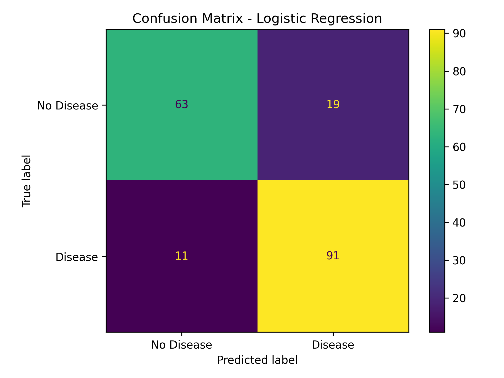
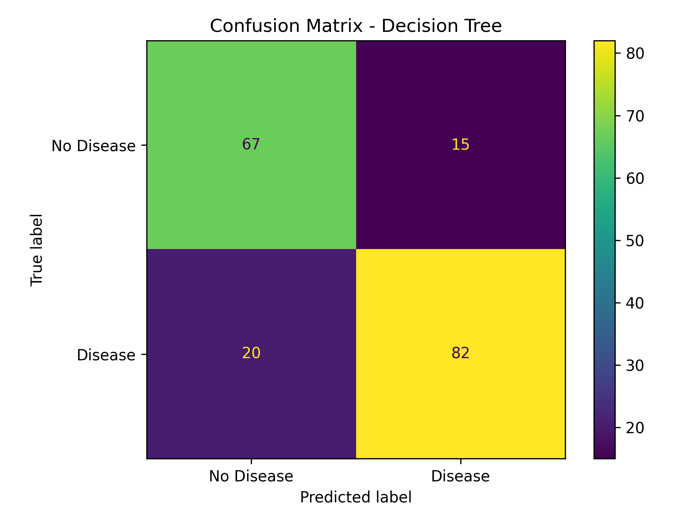
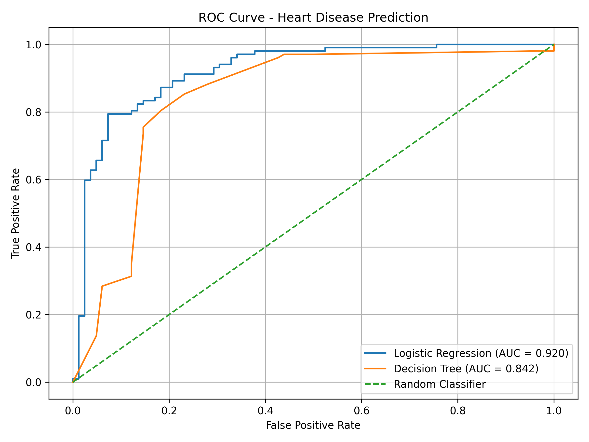

# ❤️ Heart Disease Prediction Using Machine Learning

<p align="center">
  
  
  
  
</p>

<p align="center">
  <b>A machine learning classification project for predicting the presence of heart disease from clinical and demographic features.</b>
</p>

---

## 📌 Project Overview

Heart disease prediction is a binary classification problem where machine learning models can be used to identify patterns associated with the presence or absence of heart disease.

This project uses the **Heart Disease UCI dataset** and implements a complete machine learning workflow:

**Data Loading → Data Cleaning → Missing Value Handling → Feature Scaling → Categorical Encoding → Model Training → Evaluation → Visualization**

Two machine learning algorithms are implemented:

- **Logistic Regression**
- **Decision Tree**

The models are evaluated using:

- Accuracy
- Precision
- Recall
- ROC-AUC
- Confusion Matrix
- ROC Curve

---

## 🎯 Project Objectives

The main objectives of this project are:

- Perform data cleaning and preprocessing.
- Handle missing values appropriately.
- Convert the original target into a binary classification problem.
- Scale numerical features.
- Encode categorical features.
- Train Logistic Regression and Decision Tree models.
- Evaluate classification performance using multiple metrics.
- Generate confusion matrix visualizations.
- Generate ROC curves.
- Save model predictions and evaluation results as CSV files.

---

## 📊 Dataset

The project uses the **Heart Disease UCI dataset** containing **920 records and 16 original columns**.

### Dataset Summary

| Property | Details |
|---|---|
| Records | 920 |
| Original Columns | 16 |
| Target Column | `num` |
| Final Target Column | `target` |
| Problem Type | Binary Classification |
| Training Samples | 736 |
| Testing Samples | 184 |

### Features Used

| Feature | Description |
|---|---|
| `age` | Age of the patient |
| `sex` | Sex |
| `dataset` | Dataset/source group |
| `cp` | Chest pain type |
| `trestbps` | Resting blood pressure |
| `chol` | Serum cholesterol |
| `fbs` | Fasting blood sugar |
| `restecg` | Resting electrocardiographic results |
| `thalch` | Maximum heart rate achieved |
| `exang` | Exercise-induced angina |
| `oldpeak` | ST depression |
| `slope` | Slope of the ST segment |
| `ca` | Number of major vessels |
| `thal` | Thalassemia-related feature |

The `id` column was removed because it is an identifier rather than a useful predictive feature.

---

## 🔄 Target Transformation

The original dataset contains the `num` target with values from **0 to 4**.

For this binary classification project, the target was transformed as follows:

| Original `num` | New `target` | Meaning |
|---:|---:|---|
| 0 | 0 | No Heart Disease |
| 1–4 | 1 | Heart Disease |

### Target Distribution

| Class | Samples |
|---|---:|
| No Heart Disease | 411 |
| Heart Disease | 509 |
| **Total** | **920** |

---

## 🧹 Data Preprocessing

### 1. Missing Value Handling

The dataset contains missing values in several numerical and categorical features.

For numerical features:

```text
SimpleImputer(strategy="median")
```

For categorical features:

```text
SimpleImputer(strategy="most_frequent")
```

This allows the models to work with incomplete records without removing a large number of observations.

### 2. Numerical Feature Scaling

Numerical features were standardized using:

```text
StandardScaler()
```

The numerical features include:

- `age`
- `trestbps`
- `chol`
- `thalch`
- `oldpeak`
- `ca`

### 3. Categorical Feature Encoding

Categorical features were converted into numerical representations using:

```text
OneHotEncoder(handle_unknown="ignore")
```

This allows categorical variables to be used by the machine learning models.

### 4. Preprocessing Pipeline

A `ColumnTransformer` was used to apply different preprocessing steps to numerical and categorical features.

The resulting processed dataset contains:

```text
Training features: 736 samples × 29 features
Testing features: 184 samples × 29 features
```

---

## ✂️ Train-Test Split

The dataset was divided into:

```text
Training Data: 80%
Testing Data: 20%
```

The split used:

```python
random_state = 42
stratify = y
```

Final dataset split:

| Dataset | Samples |
|---|---:|
| Training | 736 |
| Testing | 184 |
| Total | 920 |

---

## 🤖 Machine Learning Models

### 1. Logistic Regression

Logistic Regression is a supervised machine learning algorithm commonly used for binary classification.

In this project, it predicts whether a patient belongs to:

```text
0 → No Heart Disease
1 → Heart Disease
```

### 2. Decision Tree

Decision Tree is a supervised learning algorithm that makes predictions using a sequence of decision rules.

The Decision Tree used in this project was configured with:

```python
DecisionTreeClassifier(
    random_state=42,
    max_depth=5
)
```

---

## 📈 Model Performance

The models were evaluated using the testing dataset.

| Model | Accuracy | Precision | Recall | ROC-AUC |
|---|---:|---:|---:|---:|
| Logistic Regression | 83.70% | 82.73% | 89.22% | 0.9204 |
| Decision Tree | 80.98% | 84.54% | 80.39% | 0.8424 |

### Logistic Regression

```text
Accuracy  : 83.70%
Precision : 82.73%
Recall    : 89.22%
ROC-AUC   : 0.9204
```

Confusion Matrix:

```text
[[63 19]
 [11 91]]
```

### Decision Tree

```text
Accuracy  : 80.98%
Precision : 84.54%
Recall    : 80.39%
ROC-AUC   : 0.8424
```

Confusion Matrix:

```text
[[67 15]
 [20 82]]
```

---

# 📊 Visualizations

## 1. Logistic Regression — Confusion Matrix



The confusion matrix shows the number of correct and incorrect predictions made by the Logistic Regression model.

---

## 2. Decision Tree — Confusion Matrix



The confusion matrix shows the number of correct and incorrect predictions made by the Decision Tree model.

---

## 3. ROC Curve



The ROC curve compares the True Positive Rate and False Positive Rate across different classification thresholds.

### ROC-AUC Results

| Model | ROC-AUC |
|---|---:|
| Logistic Regression | 0.9204 |
| Decision Tree | 0.8424 |

---

## 📐 Evaluation Metrics

### Accuracy

Accuracy represents the proportion of total predictions that were correct.

```text
Accuracy = Correct Predictions / Total Predictions
```

### Precision

Precision represents the proportion of predicted positive cases that were actually positive.

```text
Precision = TP / (TP + FP)
```

### Recall

Recall represents the proportion of actual positive cases that were correctly identified.

```text
Recall = TP / (TP + FN)
```

### ROC-AUC

ROC-AUC measures how well a classification model separates the two classes across different classification thresholds.

---

## 🧮 Confusion Matrix

A confusion matrix contains four important values:

| Term | Meaning |
|---|---|
| True Positive (TP) | Correctly predicted heart disease |
| True Negative (TN) | Correctly predicted no heart disease |
| False Positive (FP) | Predicted heart disease when it was absent |
| False Negative (FN) | Failed to identify heart disease |

### Logistic Regression

```text
True Negative  = 63
False Positive = 19
False Negative = 11
True Positive  = 91
```

### Decision Tree

```text
True Negative  = 67
False Positive = 15
False Negative = 20
True Positive  = 82
```

---

## 🔄 Machine Learning Workflow

```text
                    ┌──────────────────────┐
                    │  Heart Disease UCI   │
                    │       Dataset        │
                    └──────────┬───────────┘
                               │
                               ▼
                    ┌──────────────────────┐
                    │    Data Cleaning     │
                    └──────────┬───────────┘
                               │
                               ▼
                    ┌──────────────────────┐
                    │ Missing Value        │
                    │ Handling             │
                    └──────────┬───────────┘
                               │
                               ▼
                    ┌──────────────────────┐
                    │ Scaling & Encoding   │
                    └──────────┬───────────┘
                               │
                               ▼
                    ┌──────────────────────┐
                    │   Train-Test Split   │
                    └──────────┬───────────┘
                               │
                     ┌─────────┴─────────┐
                     ▼                   ▼
            ┌────────────────┐   ┌────────────────┐
            │ Logistic       │   │ Decision Tree  │
            │ Regression     │   │                │
            └───────┬────────┘   └───────┬────────┘
                    │                    │
                    └──────────┬─────────┘
                               ▼
                    ┌──────────────────────┐
                    │  Model Evaluation    │
                    └──────────┬───────────┘
                               │
                               ▼
                    ┌──────────────────────┐
                    │ Accuracy / Precision │
                    │ Recall / ROC-AUC     │
                    └──────────┬───────────┘
                               │
                               ▼
                    ┌──────────────────────┐
                    │ Visualizations &     │
                    │ Predictions          │
                    └──────────────────────┘
```

---

## 📁 Project Structure

```text
Heart-Disease-Prediction/
│
├── heart_disease_uci.csv
│
├── heart_disease_prediction.py
│
├── generate_confusion_matrices.py
│
├── confusion_matrix_logistic.png
│
├── confusion_matrix_decision_tree.png
│
├── roc_curve.png
│
├── model_comparison.csv
│
├── predictions.csv
│
└── README.md
```

---

## 📄 Project Files

| File | Description |
|---|---|
| `heart_disease_uci.csv` | Heart disease dataset |
| `heart_disease_prediction.py` | Main machine learning implementation |
| `generate_confusion_matrices.py` | Script for generating confusion matrix images |
| `confusion_matrix_logistic.png` | Logistic Regression confusion matrix |
| `confusion_matrix_decision_tree.png` | Decision Tree confusion matrix |
| `roc_curve.png` | ROC curve comparison |
| `model_comparison.csv` | Model evaluation results |
| `predictions.csv` | Model predictions on test data |
| `README.md` | Project documentation |

---

## 🛠️ Technologies Used

- **Python 3**
- **Pandas**
- **NumPy**
- **Matplotlib**
- **Scikit-learn**
- **Logistic Regression**
- **Decision Tree**
- **Data Preprocessing**
- **Data Visualization**

---

## ⚙️ Installation & Setup

### 1. Clone the Repository

```bash
git clone https://github.com/rxhul77/Heart-Disease-Prediction.git
```

### 2. Navigate to the Project

```bash
cd Heart-Disease-Prediction
```

### 3. Install Required Libraries

```bash
pip install pandas numpy matplotlib scikit-learn
```

### 4. Run the Project

```bash
python heart_disease_prediction.py
```

---

## 💻 Example Output

```text
Original dataset shape: (920, 16)

Target distribution:
target
1    509
0    411

Training samples: 736
Testing samples: 184

========== LOGISTIC REGRESSION ==========
Accuracy: 0.837
Precision: 0.8273
Recall: 0.8922

Confusion Matrix:
[[63 19]
 [11 91]]

========== DECISION TREE ==========
Accuracy: 0.8098
Precision: 0.8454
Recall: 0.8039

Confusion Matrix:
[[67 15]
 [20 82]]

========== ROC-AUC ==========
Logistic Regression AUC: 0.9204
Decision Tree AUC: 0.8424

All graphs generated successfully!

Model comparison saved as model_comparison.csv
Predictions saved as predictions.csv
```

---

## 📚 Key Learning Outcomes

Through this project, I practiced:

- Data cleaning using Pandas
- Handling missing values
- Feature scaling
- Categorical feature encoding
- Binary target transformation
- Train-test splitting
- Building preprocessing pipelines
- Logistic Regression
- Decision Tree classification
- Confusion matrix analysis
- ROC curve visualization
- ROC-AUC evaluation
- Saving predictions to CSV
- Comparing machine learning models
- Creating GitHub project documentation

---

## 🚀 Future Improvements

Possible future improvements include:

- Hyperparameter tuning
- Cross-validation
- Feature selection
- Additional classification algorithms
- Class imbalance analysis
- Model interpretability
- SHAP-based explanations
- Interactive prediction interface
- Streamlit deployment
- Flask or FastAPI deployment
- Docker containerization

---

## ⚠️ Disclaimer

This project is created for **educational and machine learning practice purposes only**.

The predictions generated by this project should **not be used as medical advice or as a substitute for professional medical diagnosis**.

---

## 👨‍💻 Author

### Rahul Singh

**B.Tech Computer Science & Engineering**

Areas of Interest:

- Artificial Intelligence
- Machine Learning
- Data Structures & Algorithms
- Software Development

---

## ⭐ Project Status

**Completed ✅**

This project demonstrates an end-to-end machine learning workflow for binary heart disease classification, including:

**Data Preprocessing → Model Training → Evaluation → Visualization → Prediction**

---

<p align="center">
  Made with ❤️ using Python & Machine Learning
</p>